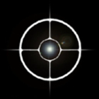

#### Previous

###### Section I: [Introduction](i_introduction.md)

###### Section II: [Setting Up MAGIC](ii_setting_up.md)

###### Section III: [Determining and Loading the Input Image](iii_determining_and_loading_the_input_image.md)

###### Section IV: [Selecting Guide & Reference Stars for an Input Image and Writing Out Files](iv_select_stars_and_write_files.md)

###### Section V: [Testing Selections in DHAS](v_testing_in_dhas.md)

###### Section VI: [Contingency: Re-selecting Stars and Re-running DHAS](vi_contingency_reselect_stars.md)

###### Section VII: [Writing the Segment Override File (SOF)](vii_write_sof.md)

###### Section VIII: [Writing the Photometry Override File (POF)](viii_write_pof.md)

###### Appendix A: [Installing the JWST MAGIC Package](appendix_a_installing_magic.md)

###### Appendix B: [Setting Up DHAS](appendix_b_opening_dhas.md)

-----------------------------------------

Appendix C. Using APT to Get Guide Star RA & Dec
=========================================================
1. Open APT
   
   
   
2. Load the APT file for the current program:
   1. File > Retreive from STScI > Retreive using Proposal ID…
   
   2. Enter the proposal number (e.g. 1141 for Global Alignment). If you’re not sure of the number, check out [this table of proposals](http://www.stsci.edu/ftp/presto/ops/jwst-pit-status.html) (but maybe wear sunglasses while doing so).

3. Using the navigation panel at left, navigate to the "Observations" folder, open the desired observation folder, and look at the form editor for the desired observation. The observation forms are the ones that have (Obs #) in their name.

4. Click the **Special Requirements** tab

5. If the observation is a NIRCam observation ("Instrument" is NIRCAM or WFSC):
   
   1. If there is a special requirement called "Guide Star ID":
      
      1. Take note of that ID (e.g. N13I018276)
      
      2. Query for this guide star using the [Guide Star Catalog webform](http://gsss.stsci.edu/webservices/GSC2/WebForm.aspx), inputting that ID as the HST ID
      
      3. Copy the RA and Dec from the web results
  
   2. If there is no "Guide Star ID" special requirement and there is a requirement that states "PCS Mode COARSE", then that observation is taking place in coarse pointing mode and guiding will not be involved. Ask yourself why you are doing this in the first place.
   
   3. If there is no "Guide Star ID" special requirement and guiding is taking place, it is not possible to get the guide star from this APT file. Talk to Ed Nelan (nelan@stsci.edu).

6. If the observation is an FGS observation: 
   
   1. If there is a special requirement called "Fiducial Point Override" that specifies a NIRCam aperture, it is not possible to get the guide star from this APT file. Talk to Ed Nelan (nelan@stsci.edu).
   
   2. Otherwise, take note of the number and name of the target for this observation.
   
   3. Using the navigation panel at left, navigate to the "Targets" folder, open the "Fixed Targets" folder, and look at the form editor for the selected target.
   
   4. Use the RA and Dec of this star for [Section VII](vii_write_sof.md)

---------------------------------

#### Next

###### Appendix D: [Mirror State Procedures](appendix_d_mirror_states.md)
