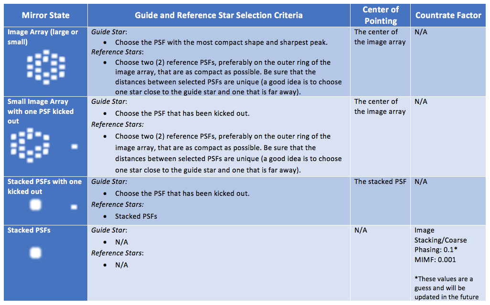

#### Previous

###### Section I: [Introduction](i_introduction.md)

###### Section II: [Setting Up MAGIC](ii_setting_up.md)

###### Section III: [Determining and Loading the Input Image](iii_determining_and_loading_the_input_image.md)

###### Section IV: [Selecting Guide & Reference Stars for an Input Image and Writing Out Files](iv_select_stars_and_write_files.md)

###### Section V: [Contingency: Re-selecting Stars](v_contingency_reselect_stars.md)

###### Section VI: [Writing the Segment Override File (SOF)](vi_write_sof.md)

###### Section VII: [Writing the Photometry Override File (POF)](vii_write_pof.md)

-----------------------------------------

Appendix A. Mirror States Expected During JWST OTE Commissioning
================================================================

