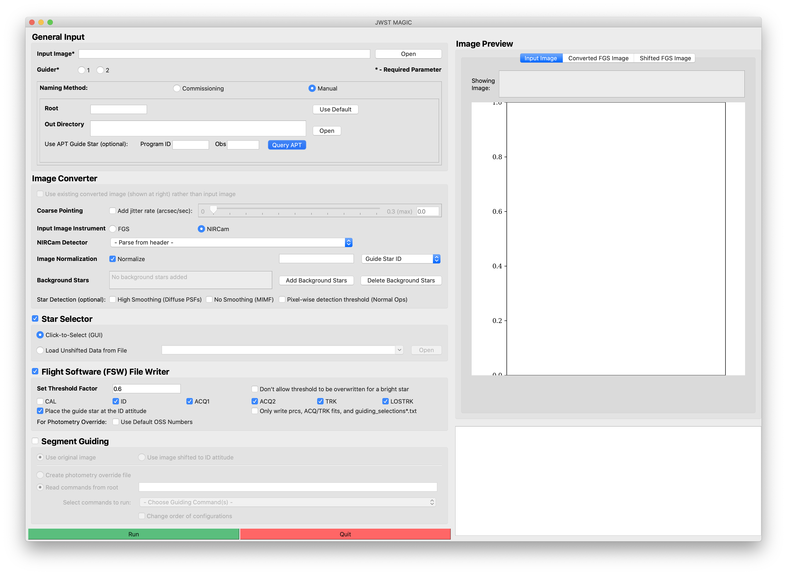

#### Previous

###### Section I: [Introduction](i_introduction.md)

---------------------

II. Setting Up MAGIC
====================

1. If you have not yet installed the tools, follow the instructions on the [front page of this repository](../README.md).
2. Check that you are in the correct environment.
3. Make sure that you have the most up-to-date version of the tools (`pull` the most recent version of the tools from the repo):

       $ cd /Users/<username>/jwst-magic

       $ git pull origin master

4. From your `magic` environment, start an IPython session and launch the main GUI (see figure below):

       $ ipython

       In [1]: import jwst_magic

       In [2]: jwst_magic.run_tool_GUI()

    

---------------------------------------

#### Next

###### Section III: [Determining and Loading the Input Image](iii_determining_and_loading_the_input_image.md)

###### Section IV: [Selecting Guide & Reference Stars for an Input Image and Writing Out Files](iv_select_stars_and_write_files.md)

###### Section V: [Contingency: Re-selecting Stars](v_contingency_reselect_stars.md)

###### Section VI: [Writing the Segment Override File (SOF)](vi_write_sof.md)

###### Section VII: [Writing the Photometry Override File (POF)](vii_write_pof.md)

###### Appendix A: [Mirror States Expected During JWST OTE Commissioning](appendix_mirror_states.md)
