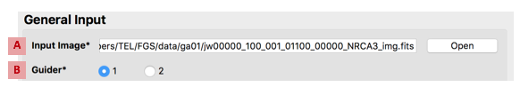
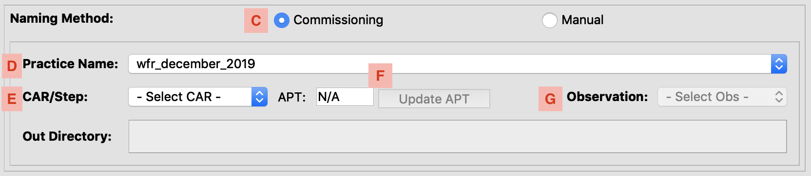
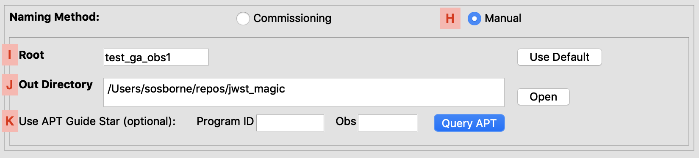
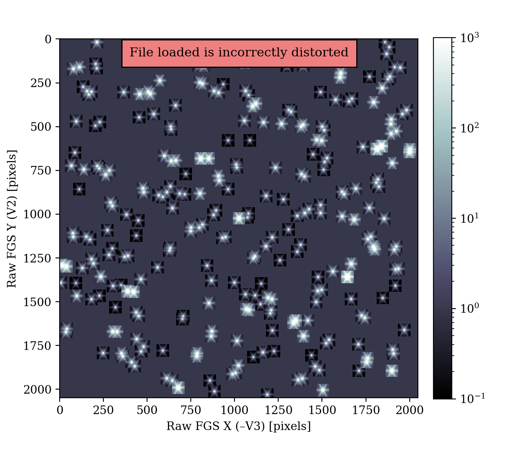
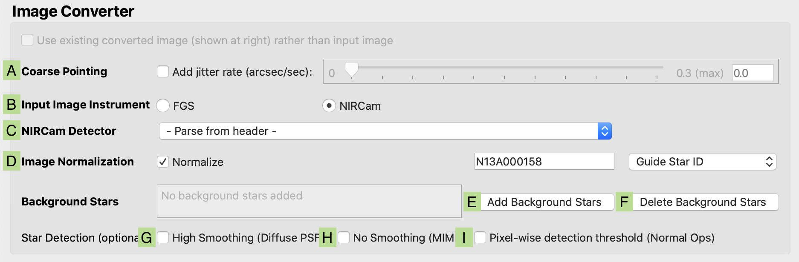
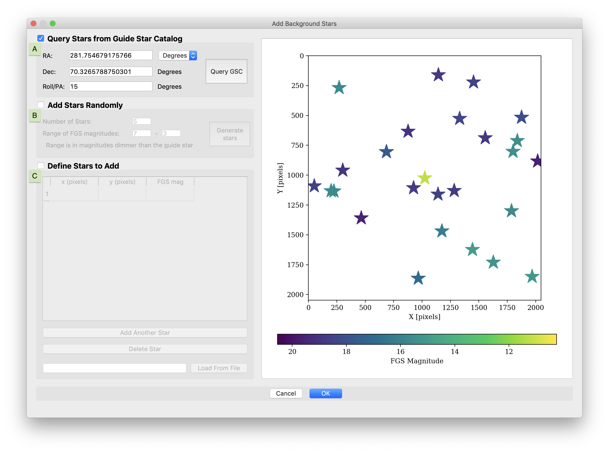

#### Previous

###### Section I: [Introduction](i_introduction.md)

###### Section II: [Setting Up MAGIC](ii_setting_up.md)

-----------------------------------------

III.	Determining and Loading the Input Image
=============================================

MAGIC takes in a full-frame calibration FGS image or a NIRCam image from *any* of their detectors that was taken with the CLEAR filter in. Note that the NIRCam weak lens (WL) filter will cause MAGIC to crash. Any input image from NIRCam is expected to be fully processed through the DMS, though both DMS-processed and raw full-frame FGS data is accepted. However, to use the commissioning naming feature, the input image will need to have a name ending with _cal.fits or _cal_full_frame.fits, in order to match with plans for commissioning. Other types of images may be used with the manual naming feature. MAGIC cannot currently accept FGS ID strips data as an input. 

In most cases, MAGIC can determine from the header information which instrument and detector the image is from. However if it can’t figure this out due to a missing or different header keyword, you will have to help it by entering this information into MAGIC. Once it has all the information it needs (particularly which guider detector you want to create the pseudo-FGS image for) MAGIC will convert the input image into an undistorted FGS image with a coordinate frame matching the FGS raw frame.

MAGIC expects to use a cal.fits image is used as the input. MAGIC will check for the PHOTMJSR header keyword and use that to convert the image to a rate image, one with units of Dn/s (also known as ADU/s).

If MAGIC is given a NIRCam or FGS cal.fits image, it will have its distortion removed correctly. If any other type of non-cal image is passed in (e.g. a rate image, an ITM image, or a mirage seed image), MAGIC will not be able to accurately remove the image's distortion. Keep this in mind when selecting an input image, and choose cal images whenever possible. When distortion cannot be removed from the input image, there may be small discrepancies in RA and Dec of commanded positions in a SOF. Padded TRK images also cannot have their distortion corrected, but in this case the only possible impact would be in the photometry, which should be minimal.

1. Set general input parameters:

   

   1. Load the **Input Image** (*A*) and a preview of the image and the full path to the image will appear in the **Image Preview** box at right.
   2. Specify the **Guider** (*B*) that the final image should simulate. If this is not known, check the APT file (see [Appendix B](appedix_b_opening_dhas.md) for more information about using APT). If you plan to query APT for the guide star information, you will get a pop up if you selected guider does not match what is in the APT file.

2. If you are running MAGIC on the SOGS network to generate files for commissioning, for an **expected** observation number:

   

   1. Check the **Commissioning** radio button (*C*) to set the naming method.
   2. Select the **Practice Name** directory (*D*) corresponding to the current practice/rehearsal.
   3. Select the **CAR/Step** name (*E*) of the activity you are generating an override file for.
   4. Select the **Observation** number (*G*) of the activity you are generating an override file for. _(The observations in the dropdown box that are preceded by `+` are extras, in the case that an unplanned observation gets generated on-the-fly.)_
   5. (Optional) Re-set the APT number and select the **Update APT** button (*F*) to query a different APT file (e.g. if you are in a rehearsal, use the rehearsal APT number)

   Considering these parameters all together, the output files will be saved in the `/data/jwst/wss/guiding/{practice}/{car}/out/for_obs{obs}/` directory, with the root `for_obs{obs}_G{guider}`.

   Setting the CAR and Observation number will automatically query APT and the Guide Star Catalog and pre-populate the guide star ID in the normalization field and the Program ID, Obs #, RA, and DEC in the SOF pop up.

3. If you are running MAGIC on the SOGS network to generate files for commissioning, for an **unexpected** observation number:

   

   1. Check the **Manual** radio button (*H*) to set the naming method.
   2. Specify the **Root** name (*I*) to be `for_obs{obs}`, using the unexpected observation number.
   3. Specify the **Out** directory (*J*) to be `/data/jwst/wss/guiding/{practice}/{car}/`, filling in the directory for the current practice/rehearsal and the name of the current activity.
   4. Specify the APT Program ID and Observation Number and select the **Query APT** button (*K*) to query the APT file and Guide Star Catalog

   Considering these parameters all together, the output files will be saved in the `/data/jwst/wss/guiding/{practice}/{car}/out/for_obs{obs}/` directory, with the root `for_obs{obs}_G{guider}`.

   Setting the CAR and Observation number will automatically query APT and the Guide Star Catalog and pre-populate the guide star ID in the normalization field and the Program ID, Obs #, RA, and DEC in the SOF pop up.

4. If you are running MAGIC outside of SOGS, or to generate test data:

   1. Check the **Manual** radio button (*H*) to set the naming method.
   2. Specify a **Root** name (*I*). If different than the default name that was created when the input image was uploaded. The root will be used to to create the output directory where all created files will reside, out/{root}.
   3. Change the **Out** directory (*J*). Choose the location to where the files will be saved. An `out/` directory will be created in this location, and this is where all the files will be saved.
   4. (Optional) Specify the APT Program ID and Observation Number and select the **Query APT** button (*K*) to query the APT file and Guide Star Catalog

   Considering these parameters all together, the output files will be saved in the `{out}/out/{root}/` directory, with names of the format `{root}_G{guider}`

   Setting the CAR and Observation number will automatically query APT and the Guide Star Catalog and pre-populate the guide star ID in the normalization field and the Program ID, Obs #, RA, and DEC in the SOF pop up.

5. Once the general input parameters are set, if the guider, root, and out directory have already been used, the previously generated FGS image will appear in the **Image Preview** box on the right. If you see a label in the Image Preview box that says "File loaded is incorrectly distorted", this is a warning that the previously-made converted FGS file is out of date with new MAGIC changes and should be re-run through the Image Conversion section of MAGIC.

    

6. Set image conversion parameters: (Note: The steps labelled “optional” below will create higher-fidelity simulations, but are not necessary when using MAGIC to generate FSW input or guiding override files.)

   

   1. (Optional) Simulate the effects of **Coarse Pointing** (*A*)  by specifying the jitter rate of the observatory. A jitter rate of 0.7 arcsec/sec creates images that are similar to ITM simulations in coarse point. Otherwise, ensure the **Add jitter rate** box is unchecked.
   2. Check that the **Input Image Instrument** (*B*) and **NIRCam detector** (*C*) used to take the input image are set to the correct values; change them if not. (The tool will attempt to parse the NIRCam detector from the input FITS header, but can be changed if the header cannot be parsed for this information.) The FGS-formatted image will be saved to `out/{root}/FGS_imgs/{input_image}_G{guider}.fits`
   3. (Optional) Specify Guide Star ID of the guide star you are trying to simulate, or the FGS magnitude, or FGS count rate for the **Image Normalization** (*D*) of the final image. If you do not want your image to renormalized, ensure the **Normalize to** box is unchecked. If you are using the commissioning naming feature, you are not allowed to pass in an FGS countrate, as this is not an expected case for commissioning.
   4. (Optional) Add **Background Stars** to the final image.

      1. Click **Add Background Stars** (*E*). The background stars dialog box will appear:

        

      2. Select which method you wish to use to add stars to the image: with a Guide Star Catalog (GSC) query, randomly, or with a user-defined table.

          1. To add stars using a web query from the Guide Star Catalog:

             1. Select the **Query Stars from Guide Star Catalog** (*A*) checkbox.
             2. Enter the RA and Dec of the guide star, being sure to specify if the RA units as either degrees or hours.
             3. Enter the position angle (roll angle) of the observatory.
             4. Click the **Query GSC** button to add the objects (stars and extended sources) that are visible in the FOV of the selected guider.
             - Note: The guide star catalog version that is queried will be the default catalog version called in the FGS Count Rate Module.

          2. To add stars randomly:

             1. Select the **Add Stars Randomly** (*B*) checkbox.
             2. Input the number of stars you want to add to the image
             3. Specify the magnitude range that these additional stars will lie between (relative to the magnitude of the guide star).
                - E.g. If you have a guide star of 12th FGS magnitude and you specify a range of 7-3, the background stars created will have FGS magnitudes between 19 and 15 magnitude, which is between 7 magnitudes dimmer than the guide star and 3 magnitudes dimmer than the guide star

          3. To add stars individually:

             1. Select the **Define Stars to Add** (*C*)  checkbox.
             2. If you wish to load star locations and brightness from a file, indicate the location of that file.
             3. Otherwise, enter into the table the X position in pixels, the Y position in pixels, and the count rate in FGS Magnitude of each star you wish to add. Click the **Add Another Star** button to add another row to the table, or the **Delete Star** button to remove a row.

          - Note: Stars that are marked with a red outline are stars that are present in the GSC query, but cannot have their FGS magnitudes calculated. Users should keep these stars in mind if any of them are close to the guide star. The background stars GUI will save out a map of these background stars in the top level of the directory name "background_stars_root_G#.png" which can be referred to when selecting stars.

      3. Click **Done** to save and apply these selections, or click **Cancel** to close the window without updating the background star selections.
      4. Verify that the indicator shows that the correct number of background stars have been added.
      5. The background stars will remain loaded until the user clicks the **Delete Background Stars** button (*F*) in the main GUI. This means that these will stay as you move to the next observation which is helpful if the guide star or PA has not changed, however if either has changed, you will need to either delete the background stars or add new ones using the steps above.
    5. (Optional) Inspect the input image and determine if your PSF(s) meet one of the three scenarios that requires a change to how the code finds stars in the input image. If you are working with early commissioning and/or diffuse PSFs (but not in MIMF), check the **High Smoothing (Diffuse PSFs)** box (*G*). If you are working with MIMF PSFs, check the **Low Smoothing (MIMF)** box (*H*). If you are working with normal operations images, check the **Pixel-wise detection threshold (Normal Ops)** box (*I*).
        - For the high smoothing option, the flag widens the smoothing filter for diffuse images in early commissioning stages when the telescope is un-phased. (If you are unsure if the PSFs are phased, consult the procedure’s information on your observation). A good time to use this flag is when you see that MAGIC has identified more than one peak within one PSF.
        - For the low smoothing option, the flag applies very little smoothing to better find the bright knot on doughnut PSFs like in MIMF rather than finding the center of the PSF. This flag must be used for MIMF images in order for our DHAS files to be made correctly.
        - For the pixel-wise detection threshold option, setting the flag triggers MAGIC to calculate the pixel-wise threshold at which a PSF with an SNR of at least 5 would be detected. The sigma=5 can be adjusted in the `utils.find_peaks()` function. This is tailored to normal operations PSFs and will likely not work well for commissioning images. 
        - Note: While we have found that these flags are best set for certain image types, if the user finds that the code isn't finding the locations of stars correctly, they can feel free to play around with these star detection options.

#### Next

###### Section IV: [Selecting Guide & Reference Stars for an Input Image and Writing Out Files](iv_select_stars_and_write_files.md)

###### Section V: [Testing Selections in DHAS](v_testing_in_dhas.md)

###### Section VI: [Contingency: Re-selecting Stars and Re-running DHAS](vi_contingency_reselect_stars.md)

###### Section VII: [Writing the Segment Override File (SOF)](vii_write_sof.md)

###### Section VIII: [Writing the Photometry Override File (POF)](viii_write_pof.md)

###### Appendix A: [Installing the JWST MAGIC Package](appendix_a_installing_magic.md)

###### Appendix B: [Setting Up DHAS](appendix_b_opening_dhas.md)

###### Appendix C: [Mirror State Procedures](appendix_c_mirror_states.md)
