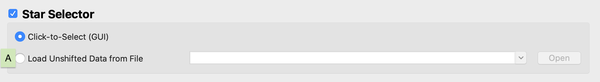

#### Previous

###### Section I: [Introduction](i_introduction.md)

###### Section II: [Setting Up MAGIC](ii_setting_up.md)

###### Section III: [Determining and Loading the Input Image](iii_determining_and_loading_the_input_image.md)

--------------------------

IV.	Selecting Guide & Reference Stars for an Input Image and Writing Out Files
==============================================================================
One of the main features of MAGIC is that it allows the user to determine the guide and reference stars for a specific scene. While during normal operations this is determined by the Guide Star Selection System (GSSS), during OTE commissioning the MAGIC user will determine which PSFs will be used for guiding and as reference stars. You can turn on this feature by selecting the **Star Selector** check box.

1. Set star selection parameters:

   

   1. Ensure the **Star Selector** box is checked.
   2. If desired, load pre-selected guide and reference stars from one or more files by selecting the **Load from File** (*C*) option. Clicking the dropdown menu will show which files are already selected. If you want to change this, click the the "Open" button, and select the desired un-shifted guiding selections file(s), using shift+click or command+click on a MAC (ctrl+click on a PC) to select multiple files. These files must include X/Y pixel coordinates and the 3x3 count rate sum around the bright pixel in the selected PSFs. Providing this will bypass using the Star Selection GUI to Click-to-Select the guide and reference stars. The drop down list will be populated with all the files chosen.
      1. When loading in a file, it is better to leave the file in it's original root directory, rather than copy/paste the file to the new root directory. See below for reasoning.
      2. The order these files are selected (and they order they are in the list) will be the order they are saved out in.
   3. How to check the configuration choices: There is an all_guiding_selections.yaml file that will be written out to the top level of your root directory which will keep track of all the guiding configurations selected. These configurations will be listed under the header "guiding_config_#" which references which sub-directory the data is saved under, and is followed by a list of numbers where the first number is the guide star and the following numbers are the reference stars (note: order of the reference stars does not matter). The numbering system for the stars is the same as the user sees when mousing over the image in the Star Selector GUI. When loading guiding_selections files, this YAML file will be able to pull the config information if the file loaded in is saved in a sub-directory named "guiding_config_#/" and is saved in a root directory that has an all_guiding_selections.yaml file. In this case, the code will pull the configuration from the original root's yaml file corresponding to the config number of the directory the data is saved under. If either of these conditions are not met, the loaded-in file will still be run through and saved out, but the yaml file will contain an empty list ("[]") for this configuration. Therefore, when loading in a file, it is better to leave the file where it is, rather than copy/paste the file to the new root directory.

2. Set file writer parameters:

   

   1. Ensure the **Flight Software (FSW) File Writer** box is checked.
   2. Enter in the threshold (i.e. count rate uncertainty factor) which is the degree of uncertainty in the count rate of each segment For example, an uncertainty factor of 0.9 for a star with a count rate of 1,000 writes an uncertainty of 900. Not that if the 3x3 count rate of the guide star PSF is greater that the currently accepted bright guiding limit, then the count rate threshold factor will be overwritten by a calculated threshold factor that allow the selection to pass through ID and ACQ. For multiple guiding selections, the largest threshold factor will be selected. If the user does not want their threshold value to be overwritten, they can check the **Don't allow threshold to be overwritten for a bright star** box.
   3. Check that all of the *necessary FGS steps* are selected.
      1. For general guiding, this includes all of the operational steps: ID, ACQ, and TRK. (These are the default selections.)
      2. For calibration observations, add the CAL step.
   4. If you want to shift your image so that the selected guide star is moved to the center of the image, ensure the **Place the guide star at the ID attitude** box is checked. This will place the guide star at the ID attitude at (Ideal X, Ideal Y) = (0, 0).
   5. If you are testing data for a possible photometry override file and you want the data written to the FSW products to be the default values OSS would use if there were no POF submitted, check the **Use Default OSS Numbers** box. Be sure to have guide star information populated in the Image Conversion section, even if you keep the **Normalize** box unchecked.

3. Run the tool

   

4. Monitor the terminal window from which you launched the GUI to notice any possible errors that are raised.

  Note:	The output that appears in the command line is also written inside the repository at `/jwst-magic/jwst_magic/logs` or on the SOGS network at `/data/jwst/wss/guiding/MAGIC_logs`

5. When the Star Selection GUI appears:

   

   1. Inspect the PSFs in the image by moving your cursor over different PSFs. Examine the profile plot to see the distribution of light. The red horizontal line represents the saturation level of the FGS detector.
   2. Select, by clicking, which PSFs will be the guide star and the reference stars. The first star selected will be the guide star, while any subsequent stars will be reference stars. *See [Appendix C](appendix_c_mirror_states.md) to choose the guide and reference stars based on the mirror state.*
   3. Utilize the pop-up of the WSS mapping of segment names in the FGS Raw frame by checking the **Show WSS Numbers** or **Show WSS Numbers - Inverted Array** check box (*A*). Un-check the button to close the pop-up.
   3. If you want to change your selections while in the tool, use the **Make Guide Star** (*B*) button to change the guide star, use the **Delete** button (*C*) to remove individual selections, and use the **Clear Selections** button (*D*) to start over.
   4. When you are happy with your selections, click the **Save Command** button (*E*). You will see the IDs of the stars you selected appear in the **Override Commands** table (*F*).
   5. To add another command, repeat steps 1-4 to select guide and reference stars, and again click the **Save Command** button (*E*).
   6. To change the order of the commands, use the up and down arrow buttons (*G*). To view a saved command on the plot, click the **Load** button (*H*).  To remove a command from the list, click the **Delete** button (*I*).
   7. Choose the center of override pointing (*J*) for all selections. This sets the origin of the ideal frame (i.e. the location of the guide star if the segments were stacked). It can either be set as the average of the segment array, using the **Use Center of Segment Array** checkbox, the location of a specific segment using the dropdown box, or a specific location on the detector in (X,Y) detector coordinates using the **Pixel Location (X,Y)** checkbox. You can only choose one center of pointing for each root, and the information will be saved out in the center_pointing*.txt file.
   8. When you are happy with your selections, click **Done**  

   The output files will be located in the specified out directory, including the `guiding_selections` file that will include X/Y pixel coordinates and the 3x3 count rate sum around the bright pixel in the selected PSFs.

   All of the .fits and .dat files that are written to the `dhas_` and `ground_system_` directories have had the counts in those images capped at 65,535. All .fits files in the `stsci_` directory have not had such a cap applied (with the singular exception of the LOSTRK.fits file).

---------------------------------

#### Next

###### Section V: [Testing Selections in DHAS](v_testing_in_dhas.md)

###### Section VI: [Contingency: Re-selecting Stars and Re-running DHAS](vi_contingency_reselect_stars.md)

###### Section VII: [Writing the Segment Override File (SOF)](vii_write_sof.md)

###### Section VIII: [Writing the Photometry Override File (POF)](viii_write_pof.md)

###### Appendix A: [Installing the JWST MAGIC Package](appendix_a_installing_magic.md)

###### Appendix B: [Setting Up DHAS](appendix_b_opening_dhas.md)

###### Appendix C: [Mirror State Procedures](appendix_c_mirror_states.md)
