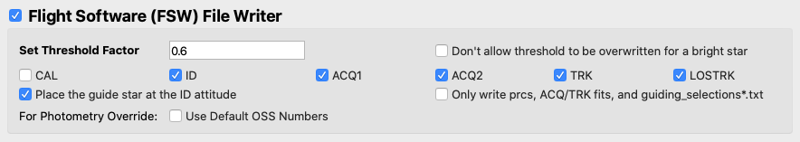

#### Previous

###### Section I: [Introduction](i_introduction.md)

###### Section II: [Setting Up MAGIC](ii_setting_up.md)

###### Section III: [Determining and Loading the Input Image](iii_determining_and_loading_the_input_image.md)

--------------------------

IV.	Selecting Guide & Reference Stars for an Input Image and Writing Out Files
==============================================================================
One of the main features of MAGIC is that it allows the user to determine the guide and reference stars for a specific scene. While during normal operations this is determined by the Guide Star Selection System (GSSS), during commissioning the MAGIC user will determine which PSFs will be used for guiding and as reference stars. You can turn on this feature by selecting the **Star Selector** check box. 

1. Set star selection parameters:

   
   
   1. Ensure the **Star Selector** box is checked.
   2. Inspect the input image and determine if your PSF(s) meet one of the two scenarios that requires a change to the smoothing technique. If you are working with early commissioning PSFs, check the **High Smoothing (For Early Commissioning)** box (*A*). If you are working with MIMF PSFs, check the **Low Smoothing (For MIMF)** box (*B*). For high smoothing, this flag widens the smoothing filter for diffuse images in early commissioning stages when the telescope is un-phased (If you are unsure if the PSFs are phased, consult the procedure’s information on your observation). For low smoothing, this flag applies very little smoothing to better find the bright knot on doughnut PSFs like in MIMF rather than finding the center of the PSF. 
   3. If desired, load pre-selected guide and reference stars from one or more files by selecting the **Load from File** (*C*) option, clicking the "Open" button, and selecting the desired un-shifted guiding selections file(s). Use shift+click or command+click to select multiple files. These files must include X/Y pixel coordinates and count rates. Providing this will bypass using the Star Selection GUI to Click-to-Select the guide and reference stars. The drop down list will be populated with all the files chosen. NOTE: The order these files are selected (and they order they are in the list) will be the order they are saved out in.

2. Set file writer parameters:
    
   
  
   1. Ensure the **Flight Software (FSW) File Writer** box is checked.
   2. Enter in the threshold (i.e. count rate uncertainty factor) which is the degree of uncertainty in the count rate of each segment For example, an uncertainty factor of 0.9 for a star with a count rate of 1,000 writes an uncertainty of 900
   3. Check that all of the *necessary FGS steps* are selected.
      1. For general guiding, this includes all of the operational steps: ID, ACQ, and TRK. (These are the default selections.)
      2. For calibration observations, add the CAL step.
   4. If you want to shift your image so that the selected guide star is moved to the center of the image, ensure the **Place the guide star at the ID attitude** box is checked. Designate whether the guiding field is crowded enough that the alternate ID attitude at (Ideal X, Ideal Y) = (-45, 0) should be used (**Crowded field**). Otherwise, leave the **Nominal** button selected such that the star is placed at (Ideal X, Ideal Y) = (0, 0).

3. Run the tool

   

4. Monitor the terminal window from which you launched the GUI to notice any possible errors that are raised.

  Note:	The output that appears in the command line is also written to:

     /data/jwst/wss/guiding/MAGIC_logs/

5. When the Star Selection GUI appears:

   

   1. Inspect the PSFs in the image by moving your cursor over different PSFs. Examine the profile plot to see the distribution of light.
   2. Select, by clicking, which PSFs will be the guide star and the reference stars. The first star selected will be the guide star, while any subsequent stars will be reference stars. *See [Appendix D](appendix_d_mirror_states.md) to choose the guide and reference stars based on the mirror state.*
   3. Utilize the pop-up of the WSS mapping of segment names in the FGS Raw frame by checking the **Show WSS Numbers Guide** check box (*A*). Un-check the button to close the pop-up.
   3. If you want to change your selections while in the tool, use the **Make Guide Star** (*B*) button to change the guide star, use the **Delete** button (*C*) to remove individual selections, and use the **Clear Selections** button (*D*) to start over.
   4. When you are happy with your selections, click the **Save Command** button (*E*). You will see the IDs of the stars you selected appear in the **Override Commands** table (*F*).
   5. To add another command, repeat steps 1-4 to select guide and reference stars, and again click the **Save Command** button (*E*).
   6. To change the order of the commands, use the up and down arrow buttons (*G*). To view a saved command on the plot, click the **Load** button (*H*).  To remove a command from the list, click the **Delete** button (*I*).
   7. Choose the center of override pointing (*J*) for all selections. This sets the origin of the ideal frame (i.e. the location of the guide star if the segments were stacked). It can either be set as the center of the segment array, using the **Use Center of Segment Array** checkbox, or the location of a specific segment using the dropdown box.
   8. When you are happy with your selections, click **Done**  
   
   The output files will be located in the specified out directory.

---------------------------------

#### Next

###### Section V: [Testing Selections in DHAS](v_testing_in_dhas.md)

###### Section VI: [Contingency: Re-selecting Stars and Re-running DHAS](vi_contingency_reselect_stars.md)

###### Section VII: [Writing the Segment Override File (SOF)](vii_write_sof.md)

###### Section VIII: [Writing the Photometry Override File (POF)](viii_write_pof.md)

###### Appendix A: [Installing the JWST MAGIC Package](appendix_a_installing_magic.md)

###### Appendix B: [Setting Up DHAS](appendix_b_opening_dhas.md)

###### Appendix C: [Using APT to Get Guide Star RA & Dec](appendix_c_apt.md)

###### Appendix D: [Mirror State Procedures](appendix_d_mirror_states.md)
