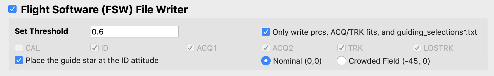

#### Previous

###### Section I: [Introduction](i_introduction.md)

###### Section II: [Setting Up MAGIC](ii_setting_up.md)

###### Section III: [Determining and Loading the Input Image](iii_determining_and_loading_the_input_image.md)

###### Section IV: [Selecting Guide & Reference Stars for an Input Image and Writing Out Files](iv_select_stars_and_write_files.md)

-----------------------------------------

V.	Contingency: Re-selecting Stars
====================================

When re-selecting stars for testing in the flight software simulator, not all of the files generated by the commissioning tools need to be rewritten; only the files affect by the choice of guide star and reference stars (namely, the ID and ACQ prcs and the ACQ1, ACQ2, and TRK fits files). Thus, though completely re-running the tool would work to re-select the guide and reference star segments (see Section IV), it is not necessary. We have developed a faster method for re-selection and file rewriting, detailed here:

1. In the main GUI, select the **Only write…** button within the Flight Software File Writer box. All other options in the interface will be disabled.

   

2. Run the tool:

   

3. When the Star Selection GUI appears, again examine your input image.
   Note: If you prefer to analyze the image in DS9, you can do so by typing `$ ds9 name_of_image.fits` into the command line or `!ds9 name_of_image.fits` in IPython. Be sure to load the image in the `…/FGS_imgs/` directory, which is your FGS image. Since DS9 displays images differently than Python, go to the Zoom menu in the menu bar of DS9 and select **Invert Y**.

4.	Select new guide/reference stars and click **Done**.

    *See [Appendix A](appendix_mirror_states.md) to choose the guide and reference star based on the mirror state.*

    This step will overwrite the existing ID.prc and regfile.txt files with the new star commands.
5.	Re-run the flight software simulator

If the flight software simulator fails again, we still need to try a different orientation of guide and reference stars until we find a successful one. Repeat this section until successful.
If the flight software simulator suceeds, continue to [Section VII](vii_write_sof.md) to create a segment override file (SOF) or [Section VIII](viii_write_pof.md) to create a photometry override file (POF).

---------------------------------

#### Next

###### Section VI: [Writing the Segment Override File (SOF)](vi_write_sof.md)

###### Section VII: [Writing the Photometry Override File (POF)](vii_write_pof.md)

###### Appendix A: [Mirror States Expected During JWST OTE Commissioning](appendix_mirror_states.md)
