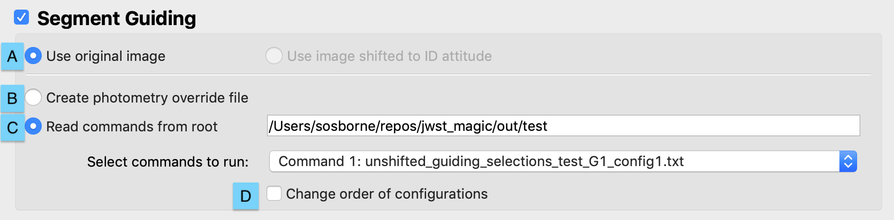

#### Previous

###### Section I: [Introduction](i_introduction.md)

###### Section II: [Setting Up MAGIC](ii_setting_up.md)

###### Section III: [Determining and Loading the Input Image](iii_determining_and_loading_the_input_image.md)

###### Section IV: [Selecting Guide & Reference Stars for an Input Image and Writing Out Files](iv_select_stars_and_write_files.md)

###### Section V: [Testing Selections in DHAS](v_testing_in_dhas.md)

###### Section VI: [Contingency: Re-selecting Stars and Re-running DHAS](vi_contingency_reselect_stars.md)

-----------------------------------------

VII. Writing the Segment Override File (SOF)
=========================================================

Another very important part of MAGIC is creating the override file that can be used to override the way guide and reference stars are selected by the GSSS. This file only has to be created when using MAGIC for commissioning activities and their rehearsals where the segments of JWST’s primary mirror are unstacked. In that case we use the PSFs created by each segment as our guide and reference stars.
1. In the main GUI, select the **Segment Guiding** box. All other options in the interface will be disabled.

   

2. If the image has been shifted so the guide star is at the ID attitude, use the radio buttons (*A*) to designate whether to generate the override file using the original (unshifted) image (**Use original image**) or using the shifted image (**Use image shifted to ID attitude** which will be available when you have selected the "Place the guide star at the ID attitude" button in the FSW File Writer section).

3. Determine what kind of override file to generate:

   1. If creating a photometry override file, click the **Create photometry override file** radio button (*B*) and see [Section VIII](viii_write_pof.md).

   2. If creating a segment override file, load guiding selections files by clicking the **Read in commands from files** radio button (*C*). By default, the path will point to the directory where all the files have been saved for this root, and the drop down box below will be populated with all the available guiding selections files in that path. 
      1. Toggle between the **Use image shifted** radio button and the **Use Original Image** radio buttons to show the shifted and unshifted selections files available in that path respectively. 
      
      2. Users can type in a new path and the drop down box will update with that path’s available guiding selection files.
    
      3. If users want to change the order of the selections files that should go into the SOF from the order they are listed in the drop down box, they should check the **Change order of configurations** check box (*D*). This will bring up a pop up box that will list the files chosen. Users should change the order of the list of guiding selections files, which can be as simple as changing the config numbers in the file names, or by copy/pasting the file names to move them around ()using keyboard shortcuts or right-clicking) ending with 1 file per line. Then hit “OK” .
        
4. Before running the tool, obtain the following parameters with the following methods (skip to iii if you used the APT query):

   1. APT parameters: If you do not know, ask the Wavefront Ops for the **Program Number**, **Observation Number(s)**, and the **Visit Number**.

   2. Guide star **RA** & **Dec**: Retrieve the guide star ID from the APT file (see [Appendix C](appendix_c_apt.md) for a step-by-step guide for doing this). Go to the Guide Star Catalog webform (http://gsss.stsci.edu/webservices/GSC2/
WebForm.aspx), and query with the guide star ID in the “HST ID” field to determine the RA and Dec.

   3. **Position Angle**: Ask the S&OC for the visit position angle at the guide star (V3PA@GS).
      See the Figure 14 to clarify the difference between V1, the target, and the guide star.

   

   4. Get the current **V2 & V3 boresight offset** from the Wavefront Ops.

5. Run the tool:

   

6. When the Segment Guiding Dialog Box appears (shown in Figure 15), define the segment guiding parameters, including:

   

   1. **Program Number** – of the current APT program; three to five digits. Input *only* the Program Number if *all* observations and visits in the program will use the same file.

   2. **Observation Number** - of the observation that will be executed: one number (e.g. "13"). Note that while POFs can have multiple observations input, this is not true for SOFs. You can only input 1 observation number. Input *only* the Program Number and Observation Number if *all* visits in a given observation will use the same file.

   3. **Visit Number** (optional) – of the visit that will be executed (this is usually 1, but will be different when mosaics, etc. are taken)

   4. **Right Ascension** – of the guide star

   5. **Declination** – of the guide star

   6. **Position Angle** – of the observatory at the guide star at the time of the visit

   7. **V2 Boresight offset** – that will be applied before the observation this file is for

   8. **V3 boresight offset** – that will be applied before the observation this file is for

   9. **Uncertainty factor** – the degree of uncertainty in the count rate of each segment. This will be auto-populated from the threshold entered in the main GUI, but can be changed here based on DHAS testing results. 

   Note: If you used the APT query functionality in [Section III](iii_determining_and_loading_the_input_image.md), the Program ID, Observation Number, Visit Number, and RA and DEC of the guide star should be pre-populated.

7. Click **OK** to continue.

---------------------------------

#### Next

###### Section VIII: [Writing the Photometry Override File (POF)](viii_write_pof.md)

###### Appendix A: [Installing the JWST MAGIC Package](appendix_a_installing_magic.md)

###### Appendix B: [Setting Up DHAS](appendix_b_opening_dhas.md)

###### Appendix C: [Using APT to Get Guide Star RA & Dec](appendix_c_apt.md)

###### Appendix D: [Mirror State Procedures](appendix_d_mirror_states.md)
