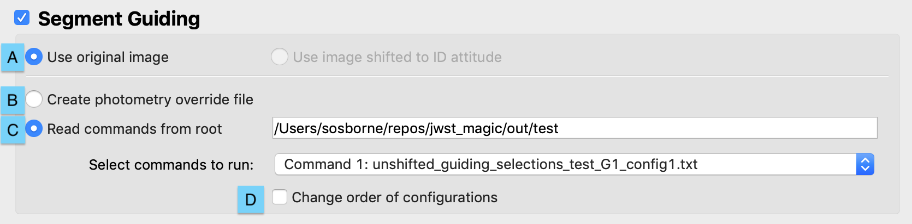
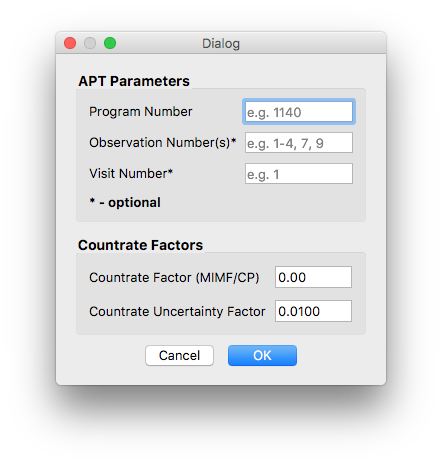

#### Previous

###### Section I: [Introduction](i_introduction.md)

###### Section II: [Setting Up MAGIC](ii_setting_up.md)

###### Section III: [Determining and Loading the Input Image](iii_determining_and_loading_the_input_image.md)

###### Section IV: [Selecting Guide & Reference Stars for an Input Image and Writing Out Files](iv_select_stars_and_write_files.md)

###### Section V: [Testing Selections in DHAS](v_testing_in_dhas.md)

###### Section VI: [Contingency: Re-selecting Stars and Re-running DHAS](vi_contingency_reselect_stars.md)

###### Section VII: [Writing the Segment Override File (SOF)](vii_write_sof.md)

-----------------------------------------

VIII.	Writing the Photometry Override File (POF)
================================================
In the case of MIMF where we only need to change the photometry of the guide star (the RA and Dec and expected count rates are taken from the APT file), we need to make an override for Planning & Scheduling but this is for the photometry and will have no information about the segments (because the PSFs from the individual segments are stacked). 

Creating a photometry override file through MAGIC:
--------------------------------------------------
1. Load the file for this observation, select the guider, the set the out directory and root.

2. As in section VII, in the main GUI, select the **Segment Guiding** check box. All other options in the interface will be disabled. Note: You do not need to run the other parts of MAGIC when creating a photometry override file.

3. Select the **Create photometry override file** radio button (*B* in figure below) 
   
   
   
4. Run the tool.
   
   
   
5. When the Segment Guiding Dialog box opens, fill in the Program ID, Observation Number, and Visit Number just as you would for creating a segment override file. Additionally, you can add the countrate factor:
   
   
   
   **Countrate factor**: A factor between 0 and 1 that all countrates and thresholds are to be multiplied by. This factor is used for cases such as MIMF and CP when the segments are stacked but unphased, and so the brightness of the guide star is dimmed.  
   
   *See [Appendix D](appendix_d_mirror_states.md) for information about the countrate factor based on the mirror state.*
   
6. Click **OK**

Creating a photometry override file in IPython: 
--------------------------------------------------
Alternatively, in the case of having to create multiple photometery override files, this can be done in IPython with a for loop.

•	**root** – the root name that will be used for the observation. This has to do with where files are saved so consistency is important

•	**program_id** – ID of the current APT program; three to five digits

•	**observation_num** – the observation number for this observation

•	**visit_num** – the visit number for this visit

•	**countrate_factor** – factor by which to multiply all countrates and thresholds

•	**out_dir** – path to the out directory where all files will be saved

     In [1]: from jwst_magic.segment_guiding import segment_guiding
    
     In [2]: root = ['root1', 'root2', 'root3', 'root4', 'root5'] #Root used for this dataset
    
     In [3]: program_id = 12345 #Program ID - int
    
     In [4]: observation_num = [1, 3, 4, 5, 7] #List of Observation numbers
    
     In [5]: visit_num = [1, 1, 1, 2, 1, 1] #List of Visit numbers
    
     In [6]: countrate_factor = 0.6 #Float between 0.0 and 1.0
     
     In [7]: out_dir = ‘/path/to/out/directory’
    
     In [8]: for i, (r, o, v) in enumerate(zip(root, observation_num, visit_num)):
                 segment_guiding.run_tool(root=r, program_id=program_id, 
                                          observation_num=o, visit_num=v, 
                                          countrate_factor=countrate_factor, 
                                          out_dir=out_dir)

---------------------------------

#### Next

###### Appendix A: [Installing the JWST MAGIC Package](appendix_a_installing_magic.md)

###### Appendix B: [Setting Up DHAS](appendix_b_opening_dhas.md)

###### Appendix C: [Using APT to Get Guide Star RA & Dec](appendix_c_apt.md)

###### Appendix D: [Mirror State Procedures](appendix_d_mirror_states.md)
