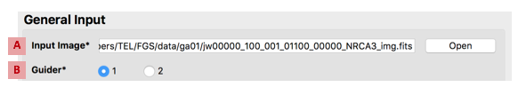

#### Previous

###### Section I: [Introduction](i_introduction.md)

###### Section II: [Setting Up MAGIC](ii_setting_up.md)

-----------------------------------------

III.	Determining and Loading the Input Image
=============================================

MAGIC takes in any FGS image or a NIRCam image that was taken with the CLEAR filter (the NIRCam weak lens (WL) filter will cause MAGIC to crash). If you want MAGIC to convert this image into a raw dectector FGS image, you can indicate this by checking the **Convert Image** check box. In most cases MAGIC can determine from the header information which instrument and detector the image is from, however if it can’t figure this out from header information, you will have to help it out by telling it which instrument and detector your input image comes from. You can also renormalize and/or add background images to your seed image.

   [MAGIC GUI][(./figs/figure1_main_gui.png)

   &nbsp;&nbsp;&nbsp;&nbsp;&nbsp;&nbsp;&nbsp;&nbsp; *Figure 1: Main GUI for the JWST MAGIC Tool*

1. Set general input parameters:

   

   &nbsp;&nbsp;&nbsp;&nbsp;&nbsp;&nbsp;&nbsp;&nbsp;  *Figure 2: General Input section of the Main GUI*

   1. Load the **Input Image** (*A*) and a preview of the image and the full path to the image will appear in the **Image Preview** box at right.
   2. Specify the **Guider** (*B*) that the final image should simulate. If this is not known, check the APT file (see [Appendix B](appedix_b_opening_dhas.md) for more information about using APT).
 
2. If you are running MAGIC on the SOGS network to generate files for commissioning:
    
   

   &nbsp;&nbsp;&nbsp;&nbsp;&nbsp;&nbsp;&nbsp;&nbsp;  *Figure 3: Commissioning naming parameter section of the main GUI*

   1. Check the **Commissioning** radio button (*C*) to set the naming method.
   2. Select the **Practice Name** (*D*) corresponding to the current activity.
   3. Select the **CAR/Step** name (*E*) of the activity you are generating an override file for.
   4. Select the **Observation** number (*F*) of the activity you are generating an override file for. _(The observations in the dropdown box that are preceded by `+` are extras, in the case that an unplanned observation gets generated on-the-fly.)_
   
   
   Considering these parameters all together, the output files will be saved in the ``/data/jwst/wss/guiding/{practice}/{car}/out/for_obs{obs}/`` directory, with the root ``for_obs{obs}_G{guider}``.

3. If you are running MAGIC outside of SOGS, or to generate test data:

   

   &nbsp;&nbsp;&nbsp;&nbsp;&nbsp;&nbsp;&nbsp;&nbsp;  *Figure 4: Manual naming parameter section of the main GUI* 

   
   1. Check the **Manual** radio button (*G*) to set the naming method.
   2. Specify a **Root** name (*H*) If different than the default name that was created when the input image was uploaded. The root will be used to to create the output directory where all created files will reside, out/{root}.
   3. Change the **Out** directory (*I*) Choose the location to where the files will be saved. An ``out/`` directory will be created in this location, and this is where all the files will be saved.

   
   Considering these parameters all together, the output files will be saved in the ``{out}/out/{root}/`` directory, with names of the format ``{root}_G{guider}``
   
4. Set image conversion parameters: (Note: The steps labelled “optional” below will create higher-fidelity simulations, but are not necessary when using MAGIC to generate FSW input or segment override files.)

   

   &nbsp;&nbsp;&nbsp;&nbsp;&nbsp;&nbsp;&nbsp;&nbsp;  *Figure 5: Image Converter section of the Main GUI*
   
   1. (Optional) Simulate the effects of **Coarse Pointing** (*A*)  by specifying the jitter rate of the observatory. A jitter rate of 0.7 arcsec/sec creates images that are similar to ITM simulations in coarse point. Otherwise, ensure the **Add jitter rate** box is unchecked.
   2. Check that the **Input Image Instrument** (*B*) and **NIRCam detector** (*C*) used to take the input image are set to the correct values; change them if not. (If the NIRCam detector is not defined, the tool will attempt to parse it from the input FITS header.) The FGS-formatted image will be saved to ``out/{root}/FGS_imgs/{input_image}_G{guider}.fits``
   3. (Optional) Specify the magnitude or counts for the **Image Normalization** (*D*) of the final image. Otherwise, ensure the **Normalize to** box is unchecked.
   4. (Optional) Add **Background Stars** to the final image.
       
      1. Click **Add Background Stars** (*E*). The background stars dialog box will appear:

        

        &nbsp;&nbsp;&nbsp;&nbsp;&nbsp;&nbsp;&nbsp;&nbsp;  *Figure 6: Background stars dialog window*

          
      2. Select which method you wish to use to add stars to the image: randomly, with a user-defined table, or with a Guide Star Catalog (GSC) 2.4.1 query.
          
          1. To add stars randomly:
             
             1. Select the **Add Stars Randomly** (*A*) checkbox.
             2. Input the number of stars you want to add to the image
             3. Specify the magnitude range that these additional stars will lie between (relative to the magnitude of the guide star)
          
          2. To add stars individually:
             
             1. Select the **Define Stars to Add** (*B*)  checkbox.
             2. If you wish to load star locations and brightness from a file, indicate the location of that file.
             3. Otherwise, enter into the table the X position in pixels, the Y position in pixels, and the countrate in J Magnitude of each star you wish to add. Click the **Add Another Star** button to add another row to the table, or the **Delete Star** button to remove a row.
          
          3. To add stars using a web query from the Guide Star Catalog:
             
             1. Select the **Query Stars from Guide Star Catalog 2.4.1** (*C*) checkbox.
             2. Enter the RA and Dec of the guide star, being sure to specify if the RA units as either hours or degrees.
             3. Enter the position angle (roll angle) of the observatory.
             4. Click the **Query GSC** button to add the stars that are visible in the FOV of the selected guider.
      3. Click **Done** to save and apply these selections, or click **Cancel** to close the window without updating the background star selections.
      4. Verify that the indicator shows that the correct number of background stars have been added.

---------------------------------
#### Next

###### Section IV: [Selecting Guide & Reference Stars for an Input Image and Writing Out Files](iv_select_stars_and_write_files.md)

###### Section V: [Testing Selections in DHAS](v_testing_in_dhas.md)

###### Section VI: [Contingency: Re-selecting Stars and Re-running DHAS](vi_contingency_reselect_stars.md)

###### Section VII: [Writing the Segment Override File (SOF)](vii_write_sof.md)

###### Section VIII: [Writing the Photometry Override File (POF)](viii_write_pof.md)

###### Appendix A: [Installing the JWST MAGIC Package](appendix_a_installing_magic.md)

###### Appendix B: [Setting Up DHAS](appendix_b_opening_dhas.md)

###### Appendix C: [Using APT to Get Guide Star RA & Dec](appendix_c_apt.md)

###### Appendix D: [Mirror State Procedures](appendix_d_mirror_states.md)

   

