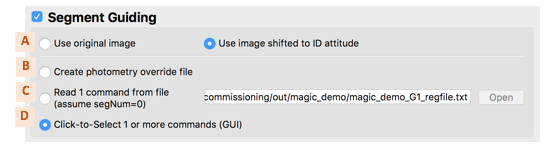
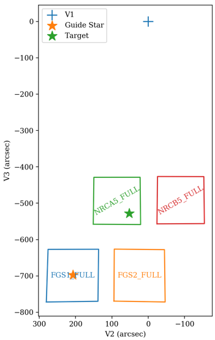
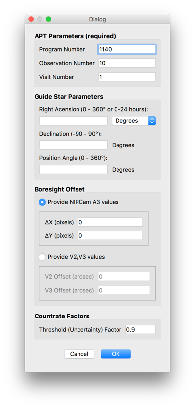
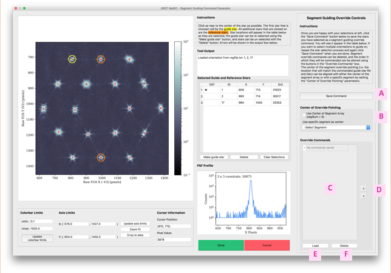

#### Previous

###### Section I: [Introduction](i_introduction.md)

###### Section II: [Setting Up MAGIC](ii_setting_up.md)

###### Section III: [Determining and Loading the Input Image](iii_determining_and_loading_the_input_image.md)

###### Section IV: [Selecting Guide & Reference Stars for an Input Image and Writing Out Files](iv_select_stars_and_write_files.md)

###### Section V: [Testing Selections in DHAS](v_testing_in_dhas.md)

###### Section VI: [Contingency: Re-selecting Stars and Re-running DHAS](vi_contingency_reselect_stars.md)

-----------------------------------------

VII. Writing the Segment Override File (SOF)
=========================================================

Another very important part of MAGIC is creating the override file that can be used to override the way guide and reference stars are selelcted by the GSSS. This file only has to be created when using MAGIC for commissioning activities and their rehearsals where the segments of JWST’s primary mirror are unstacked. In that case we use the PSFs created by each segment as our guide and reference stars. 
1. In the main GUI, select the **Segment Guiding** box. All other options in the interface will be disabled.

   

2. If the image has been shifted so the guide star is at the ID attitude, use the radio buttons (*A*) to designate whether to generate the override file using the original (unshifted) image (**Use original image**) or using the shifted image (**Use image shifted to ID attitude**).

3. Determine whether to generate an override file from an existing file or using the click-to-select GUI:
   
   a. If creating a photometry override file using the **Create photometry override file** radio button (*B*), see [Section VIII](viii_write_pof.md).
   
   b. If creating an override file for a visit where the mirrors are in an array and you wish to use the *same* guide and reference stars from [Section III](iii_determining_and_loading_the_input_image.md), select the **Read 1 command from file** radio button (*C*) and don’t change the auto-populated segment guiding filepath. This creates the segment override file so that it only uses the guide and reference stars selected by the user in [Section III](iii_determining_and_loading_the_input_image.md) and will bypass the override file creation using the Segment Guiding GUI. If making this selection, skip to step 6 below. 
   
   c. If creating an override file for a visit where the mirrors are in an array and you wish to use *different* guide and reference stars from [Section III](iii_determining_and_loading_the_input_image.md) that are specified in a different file (most likely a regfile.txt or a .incat file), select the **Read 1 command from file** radio button (*C*) a and specify the path to this file. Providing this file will create the segment override file so that it only uses the guide and reference stars selected by the user in [Section III](iii_determining_and_loading_the_input_image.md) and will bypass the override file creation using the Segment Guiding GUI. Once this file is selected, skip to step 6 below. 
   
   d. Otherwise, select the **Click-to-Select 1 or more commands (GUI)** radio button (*D*) to launch the GUI (see figure below) that will allow you to click-to-select multiple orientations of guide and reference stars.
4.	
   Before running the tool, obtain the following parameters with the following methods:
   
   a. APT parameters: If you do not know, ask the Wavefront Ops for the **Program Number**, **Observation Number**, and the **Visit Number**.
   
   b. Guide star **RA** & **Dec**: Retrieve the guide star ID from the APT file (see [Appendix C](appendix_c_apt.md) for a step-by-step guide for doing this). Go to the Guide Star Catalog webform (http://gsss.stsci.edu/webservices/GSC2/
WebForm.aspx), and query with the guide star ID in the “HST ID” field to determine the RA and Dec.
   
   c. **Position Angle**: Ask the S&OC for the visit position angle at the guide star (V3PA@GS).
      See the Figure 14 to clarify the difference between V1, the target, and the guide star.
      
   
   
   d. Get the current **V2 & V3 boresight offset** from the Wavefront Ops. 
   
5. Run the tool:

   

6. When the Segment Guiding Dialog Box appears (shown in Figure 15), define the segment guiding parameters, including:
  
   

   a. **Program Number** – of the current APT program; three to five digits
   
   b. **Observation Number** of the observation that will be executed
   
   c. **Visit Number** – of the visit that will be executed (this is usually 1, but will be different when mosaics, etc. are taken)
   
   d. **Right Ascension** (optional) – of the guide star
   
   e. **Declination** (optional) – of the guide star 
   
   f. **Position Angle** – of the observatory at the guide star at the time of the visit
   
   g. **V2 Boresight offset** (optional) – that will be applied before the observation this file is for
   
   h. **V3 boresight offset** (optional) – that will be applied before the observation this file is for
   
   i. **Uncertainty factor** (optional) – the degree of uncertainty in the countrate of each segment. e.g., an uncertainty factor of 0.9 for a star with a countrate of 1,000 writes an uncertainty of 900.

7. Click **OK** to continue.

   If the **Click-to-Select 1 or more commands (GUI)** radio buttonwas selected, the Segment Guiding GUI will appear:
   
   

8. If the Segment Guiding GUI is being used, repeat the steps outlined in [Section III](iii_determining_and_loading_the_input_image.md) to select the guide and reference stars – the ones that you verified were successful with DHAS – for one segment guiding override command.

9. When you are happy with your selections, click the **Save Command** button (*A*). You will see the IDs of the stars you selected appear in the **Override Commands** table (*C*).

10. To add another command, again repeat the steps outlined in [Section III](iii_determining_and_loading_the_input_image.md) to select guide and reference stars, and again click the **Save Command** button (*A*). 

11. To change the order of the commands, use the up and down arrow buttons (*D*). To view a saved command on the plot, click the **Load** button (*E*).  To remove a command from the list, click the **Delete** button (*A*). 

12. Choose the center of override pointing (*B*). This sets the origin of the ideal frame (i.e. the location of the guide star if the segments were stacked). It can either be set as the center of the segment array, using the **Use Center of Segment Array** checkbox, or the location of a specific segment using the dropdown box.

See [Appendix D](appendix_d_mirror_states.md) for more about selecting the center of override pointing based on the mirror state.

---------------------------------
#### Next

###### Section VIII: [Writing the Photometry Override File (POF)](viii_write_pof.md)

###### Appendix A: [Installing the JWST MAGIC Package](appendix_a_installing_magic.md)

###### Appendix B: [Setting Up DHAS](appendix_b_opening_dhas.md)

###### Appendix C: [Using APT to Get Guide Star RA & Dec](appendix_c_apt.md)

###### Appendix D: [Mirror State Procedures](appendix_d_mirror_states.md)
