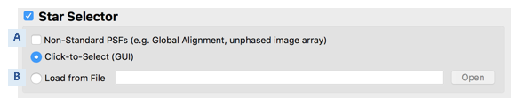
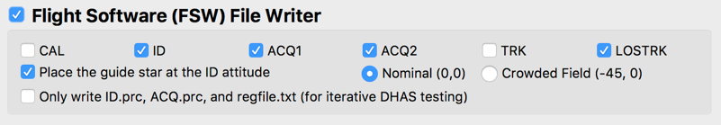

#### Previous

###### Section I: [Introduction](i_introduction.md)

###### Section II: [Setting Up MAGIC](ii_setting_up.md)

###### Section III: [Determining and Loading the Input Image](iii_determining_and_loading_the_input_image.md)

IV.	Selecting Guide & Reference Stars for an Input Image and Writing Out Files
==============================================================================
One of the main features of MAGIC is that it allows the user to determine the guide and reference stars for a specific scene. While during normal opterations this is determined by the Guide Star Selection System (GSSS), during commissioning the MAGIC user will determine which PSFs will be used for guiding and as reference stars. You can turn on this feature by selecting the **Star Selector** check box. 

1. Set star selection parameters:
   

       
   

   

       Figure 7: Star Selection section of the Main GUI
    

   1. Ensure the **Star Selector** box is checked.
   2. Inspect the input image and if the segment PSFs are arranged in an image array check the **Non-Standard PSFs** box. (*A*) This flag alters the PSF-finding algorithm in the star selector tool to widen the smoothing filter for diffuse images in early commissioning stages when the telescope is unphased. If you are unsure if the PSFs are phased, consult the “Guiding Method” row in the [Guider Commissioning Summary Table](https://innerspace.stsci.edu/display/INSTEL/Guider+Commissioning+Summary+Table) on Innerspace.
   3. If desired, load pre-selected guide and reference stars from a file by selecting the **Load from File** (*B*) option and selecting the desired input file. This file must include X/Y pixel coordinates and count rates in the form of a filepath to a regfile.txt or .incat file. Providing this will bypass using the Star Selection GUI to **Click-to-Select** the guide and reference stars. 

2. Set file writer parameters:
   

       
   

   

       Figure 8: Flight Software file writer section for the Main GUI
    

   1. Ensure the **Flight Software (FSW) File Writer** box is checked.
   2. Check that all of the *necessary FGS steps* are selected. 
      1. For general guiding, this includes all of the operational steps: ID, ACQ, and TRK. (These are the default selections.) 
      2. For calibration observations, add the CAL step.
   3. If you want to shift your image so that the selected guide star is moved to the center of the image, ensure the **Place the guide star at the ID attitude** box is checked. Designate whether the guiding field is crowded enough that the alternate ID attitude at (Ideal X, Ideal Y) = (-45, 0) should be used (**Crowded field**). Otherwise, leave the **Nominal** button selected such that the star is placed at (Ideal X, Ideal Y) = (0, 0).

3. Run the tool

  

       
   

4. Monitor the terminal window from which you launched the GUI to notice any possible errors that are raised. 

  Note:	The output that appears in the command line is also written to:
     
     ***REMOVED***/guiding/MAGIC_logs/

5. When the Star Selection GUI appears: 
   

       
   

   

       Figure 9: Star Selection GUI window
    

    
    1. Inspect the PSFs in the image by moving your cursor over different PSFs. Examine the profile plot to see the distribution of light.
    2. Select, by clicking, which PSFs will be the guide star and the reference stars. The first star selected will be the guide star, while any subsequent stars will be reference stars. *See [Appendix D](appendix_d_mirror_states.md) to choose the guide and reference stars based on the mirror state.*
    3. If you want to change your selections while in the tool, use the **Make Guide Star** (*A*) button to change the guide star, use the **Delete** button (*B*) to remove individual selections, and use the **Clear Selections** button (*C*) to start over.
    4. When you are happy with your selections, click **Done**  
   
   The output files will be located in the specified out directory.

---------------------------------
#### Next

###### Section V: [Testing Selections in DHAS](v_testing_in_dhas.md)

###### Section VI: [Contingency: Re-selecting Stars and Re-running DHAS](vi_contingency_reselect_stars.md)

###### Section VII: [Writing the Segment Override File (SOF)](vii_write_sof.md)

###### Section VIII: [Writing the Photometry Override File (POF)](viii_write_pof.md)

###### Appendix A: [Installing the JWST MAGIC Package](appendix_a_installing_magic.md)

###### Appendix B: [Setting Up DHAS](appendix_b_opening_dhas.md)

###### Appendix C: [Using APT to Get Guide Star RA & Dec](appendix_c_apt.md)

###### Appendix D: [Mirror State Procedures](appendix_d_mirror_states.md)
